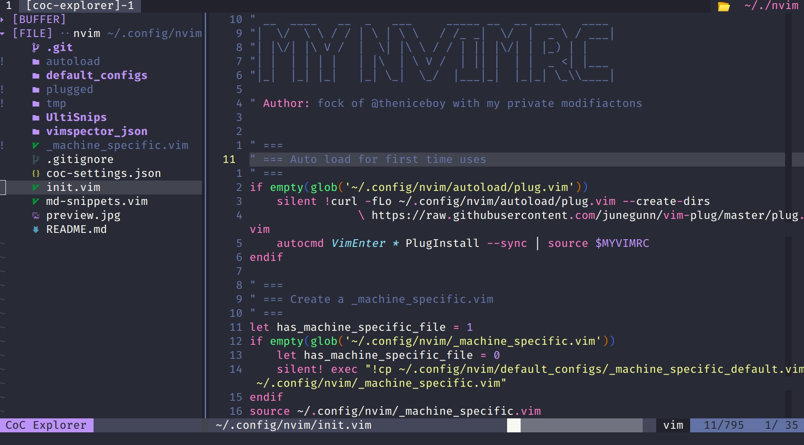

<!-- TOC GFM -->

- [介绍](#介绍)
- [安装前,您需要](#安装前您需要)
- [快速开始](#快速开始)
- [安装后,您需要](#安装后您需要)

<!-- /TOC -->

### 介绍
这是我的vim配置, 它`fock`于`@theniceboy`.<br/>
它需要`neovim` >= `0.5`<br/>



### 安装前,您需要
- [ ] 翻墙
- [ ] 安装`gcc`,`g++`,`make`,`libstdc++`
- [ ] 安装`pynvim`,推荐[pyenv](https://github.com/pyenv/pyenv)
- [ ] 安装`neovim`,推荐[nvm](https://github.com/nvm-sh/nvm)
- [ ] 安装`tree-sitter`
    - 推荐直接下载[release](https://github.com/tree-sitter/tree-sitter/releases),解压到`~/.local/bin`目录
    - `~/.local/bin`要加入环境变量
- [ ] 安装`xclip`(可选)
- [ ] 安装`perl `(可选)
- [ ] 安装`ruby `(可选)


### 快速开始
```bash
mv ~/.config/nvim ~/.config/nvim.bak
git clone --depth 1 https://github.com/Wjinlei/nvim.git ~/.config/nvim
```
### 安装后,您需要
- [ ] 编辑`_machine_specific.vim`,配置`python`路径
- [ ] 执行`:checkhealth`(检测有无错误)
